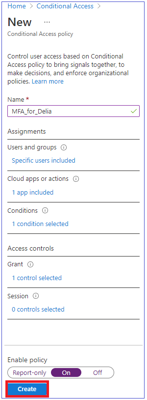

---
lab:
    title: '01 - Manage Azure Active Directory Identities'
    module: 'Module 01 - Identity'
---

# Lab 01 - Manage Azure Active Directory Identities

# Student lab manual

## Lab scenario

In order to allow Contoso users to authenticate by using Azure AD, you have been tasked with provisioning users and group accounts. Membership of the groups should be updated automatically based on the user job titles. You also need to create a test Azure AD tenant with a test user account and grant that account limited permissions to resources in the Contoso Azure subscription.

## Objectives

In this lab, you will:

+ Task 1: Create and configure Azure AD users
+ Task 2: Create Azure AD groups with assigned and dynamic membership
+ Task 3: Create an Azure Active Directory (AD) tenant
+ Task 4: Manage Azure AD guest users 
+ Task 5: Configure Conditional Access
+ Task 6: Implement Privileged Identity Management
+ Task 7: Enroll a Virtual Machine to Azure Active Directory
+ Task 8: Create a dynamic membership group for your Virtual Machine

## Estimated timing: 30 minutes

## Architecture diagram

## Instructions

### Task 1: Create and configure Azure AD users

In this task, you will create and configure Azure AD users.

>**Note**: It is recommended to create a new account for trying out the labs in this course. Please create a new account in Azure AD or create a personal microsoft account [here](accounts.microsoft.com).

1. Sign in to the [Azure portal](https://portal.azure.com).

1. In the Azure portal, search for and select **Azure Active Directory**.

1. On the Azure Active Directory blade, scroll down to the **Manage** section, click **User settings**, and review available configuration options.

1. On the Azure Active Directory blade, in the **Manage** section, click **Users**, and then click your user account to display its **Profile** settings. 

1. Click **edit**, in the **Settings** section, set **Usage location** to **United States** and click **save** to apply the change.

    >**Note**: This is necessary in order to assign an Azure AD Premium P2 license to your user account later in this lab. If you have already finished the trial of your Azure AD Premium P2 license, you can initiate a trial of the Enterprise Mobility and Security E5 License.

1. Navigate back to the **Users - All users** blade, and then click **+ New user**.

1. Create a new user with the following settings (leave others with their defaults):

    | Setting | Value |
    | --- | --- |
    | User name | **az104-01a-aaduser1** |
    | Name | **az104-01a-aaduser1** |
    | Let me create the password | enabled |
    | Initial password | **Provide a secure password** |
    | Usage location | **United States** |
    | Job title | **Cloud Administrator** |
    | Department | **IT** |

    >**Note**: **Copy to clipboard** the full **User Principal Name** (user name plus domain). You will need it later in this task.

1. In the list of users, click the newly created user account to display its blade.

1. Review the options available in the **Manage** section and note that you can identify the Azure AD roles assigned to the user account as well as the user account's permissions to Azure resources.

1. In the **Manage** section, click **Assigned roles**, then click **+ Add assignment** button and assign the **User administrator** role to **az104-01a-aaduser1**.

    >**Note**: You also have the option of assigning Azure AD roles when provisioning a new user.

1. Open an **InPrivate/Incognito** browser window and sign in to the [Azure portal](https://portal.azure.com) using the newly created user account. When prompted to update the password, change the password to a secure password of your choosing. 

    >**Note**: Rather than typing the user name (including the domain name), you can paste the content of Clipboard.

1. In the **InPrivate/Incognito** browser window, in the Azure portal, search for and select **Azure Active Directory**.

    >**Note**: While this user account can access the Azure Active Directory tenant, it does not have any access to Azure resources. This is expected, since such access would need to be granted explicitly by using Azure Role-Based Access Control. 

1. In the **InPrivate/Incognito** browser window, on the Azure AD blade, scroll down to the **Manage** section, click **User settings**, and note that you do not have permissions to modify any configuration options.

1. In the **InPrivate/Incognito** browser window, on the Azure AD blade, in the **Manage** section, click **Users**, and then click **+ New user**.

1. Create a new user with the following settings (leave others with their defaults):

    | Setting | Value |
    | --- | --- |
    | User name | **az104-01a-aaduser2** |
    | Name | **az104-01a-aaduser2** |
    | Let me create the password | enabled |
    | Initial password | **Provide a secure password** |
    | Usage location | **India** |
    | Job title | **System Administrator** |
    | Department | **IT** |

1. Sign out as the az104-01a-aaduser1 user from the Azure portal and close the InPrivate browser window.

### Task 2: Create Azure AD groups with assigned and dynamic membership

In this task, you will create Azure Active Directory groups with assigned and dynamic membership.

1. Back in the Azure portal where you are signed in with your **user account**, navigate back to the **Overview** blade of the Azure AD tenant and, in the **Manage** section, click **Licenses**.

    >**Note**: Azure AD Premium P1 or P2 licenses are required in order to implement dynamic groups.

1. In the **Manage** section, click **All products**.

1. Click **+ Try/Buy** and activate the free trial of Azure AD Premium P2.

1. Refresh the browser window to verify that the activation was successful. 

1. From the **Licenses - All products** blade, select the **Azure Active Directory Premium P2** entry, and assign all license options of Azure AD Premium P2 to your user account and the two newly created user accounts.

1. In the Azure portal, navigate back to the Azure AD tenant blade and click **Groups**.

1. Use the **+ New group** button to create a new group with the following settings:

    | Setting | Value |
    | --- | --- |
    | Group type | **Security** |
    | Group name | **IT Cloud Administrators** |
    | Group description | **US IT cloud administrators** |
    | Membership type | **Dynamic User** |

    >**Note**: If the **Membership type** drop-down list is grayed out, wait a few minutes and refresh the browser page.

1. Click **Add dynamic query**.

1. On the **Configure Rules** tab of the **Dynamic membership rules** blade, create a new rule with the following settings:

    | Setting | Value |
    | --- | --- |
    | Property | **usageLocation** |
    | Operator | **contains** |
    | Value | **ITE** |

1. Save the rule by clicking **+Add expression** and **Save**. Back on the **New Group** blade, click **Create**. 

1. Back on the **Groups - All groups** blade of the Azure AD tenant, click the **+ New group** button and create a new group with the following settings:

    | Setting | Value |
    | --- | --- |
    | Group type | **Security** |
    | Group name | **IT System Administrators** |
    | Group description | **Contoso IT system administrators** |
    | Membership type | **Dynamic User** |

1. Click **Add dynamic query**.

1. On the **Configure Rules** tab of the **Dynamic membership rules** blade, create a new rule with the following settings:

    | Setting | Value |
    | --- | --- |
    | Property | **jobTitle** |
    | Operator | **Equals** |
    | Value | **System Administrator** |

1. Save the rule by clicking **+Add expression** and **Save**. Back on the **New Group** blade, click **Create**. 

1. Back on the **Groups - All groups** blade of the Azure AD tenant, click the **+ New group** button, and create a new group with the following settings:

    | Setting | Value |
    | --- | --- |
    | Group type | **Security** |
    | Group name | **IT Lab Administrators** |
    | Group description | **Contoso IT Lab administrators** |
    | Membership type | **Assigned** |
    
1. Click **No members selected**.

1. From the **Add members** blade, search and select the **IT Cloud Administrators** and **IT System Administrators** groups and, back on the **New Group** blade, click **Create**.

1. Back on the **Groups - All groups** blade, click the entry representing the **US IT Cloud Administrators** group and, on then display its **Members** blade. Verify that the **az104-01a-aaduser1** appears in the list of group members.

    >**Note**: You might experience delays with updates of the dynamic membership groups. To expedite the update, navigate to the group blade, display its **Dynamic membership rules** blade, **Edit** the rule listed in the **Rule syntax** textbox by adding a whitespace at the end, and **Save** the change.

1. Navigate back to the **Groups - All groups** blade, click the entry representing the **IT System Administrators** group and, on then display its **Members** blade. Verify that the **az104-01a-aaduser2** appears in the list of group members.

### Task 3: Create an Azure Active Directory (AD) tenant

In this task, you will create a new Azure AD tenant.

1. In the Azure portal, search for and select **Azure Active Directory**.

1. Click **Manage tenants**, and then on the next screen, click **+ Create**, and specify the following setting:

    | Setting | Value |
    | --- | --- |
    | Directory type | **Azure Active Directory** |
    
1. Click **Next : Configuration**

    | Setting | Value |
    | --- | --- |
    | Organization name | **Contoso Lab** |
    | Initial domain name | any valid DNS name consisting of lower case letters and digits and starting with a letter | 
    | Country/Region | **United States** |

   > **Note**: The **Initial domain name** should not be a legitimate name that potentially matches your organization or another. The green check mark in the **Initial domain name** text box will indicate that the domain name you typed in is valid and unique.

1. Click **Review + create** and then click **Create**.

1. Display the blade of the newly created Azure AD tenant by using the **Click here to navigate to your new tenant: Contoso Lab** link or the **Directory + Subscription** button (directly to the right of the Cloud Shell button) in the Azure portal toolbar.

### Task 4: Manage Azure AD guest users.

In this task, you will create Azure AD guest users and grant them access to resources in an Azure subscription.

1. In the Azure portal displaying the Contoso Lab Azure AD tenant, in the **Manage** section, click **Users**, and then click **+ New user**.

1. Create a new user with the following settings (leave others with their defaults):

    | Setting | Value |
    | --- | --- |
    | User name | **az104-01b-aaduser1** |
    | Name | **az104-01b-aaduser1** |
    | Let me create the password | enabled |
    | Initial password | **Provide a secure password** |
    | Job title | **System Administrator** |
    | Department | **IT** |

1. Click on the newly created profile.

    >**Note**: **Copy to clipboard** the full **User Principal Name** (user name plus domain). You will need it later in this task.

1. Switch back to your default Azure AD tenant by using the **Directory + Subscription** button (directly to the right of the Cloud Shell button) in the Azure portal toolbar.

1. Navigate back to the **Users - All users** blade, and then click **+ New guest user**.

1. Invite a new guest user with the following settings (leave others with their defaults):

    | Setting | Value |
    | --- | --- |
    | Name | **az104-01b-aaduser1** |
    | Email address | the User Principal Name you copied earlier in this task |
    | Usage location | **Canada** |
    | Job title | **Lab Administrator** |
    | Department | **IT** |

1. Click **Invite**. 

1. Back on the **Users - All users** blade, click the entry representing the newly created guest user account.

1. On the **az104-01b-aaduser1 - Profile** blade, click **Groups**.

1. Click **+ Add membership** and add the guest user account to the **IT Lab Administrators** group.

### Task 5: Configure Conditional Access with Named Locations

1. Browse to [https://portal.azure.com](https://portal.azure.com) and sign in using a Global administrator account for the directory.

2. Open the portal menu and then select **Azure Active Directory**.

3. On the Azure Active Directory blade, under **Manage**, select **Security**.

4. On the Security blade, in the left navigation, select **Conditional access**.

5. On the top menu, select **+ New policy** from the drop-down select **Create a new policy**.

    

6. In the **Name** box, enter **Require Compliant Device**.

    **Note** - Using this naming to help you quickly recognize the policy and its function.

7. Under **Assignments**, select **Users or workload identities**.

8. On the Include tab, select the **Users and groups** check box.

9. In the Select pane, select **az104-01a-aaduser1** account and then select **Select**.

10. Select **Cloud apps or actions**.

11. Verify **Cloud apps** is selected and then select **Select apps**.

12. In the Select pane, search for **Azure** and select **Microsoft Azure Management** and then select **Select**.

13. Under **Access controls**, select **Grant**.

14. In the Grant pane, select **Block access** and then select **Select**.

    **Note** - This policy is being configured for the exercise only and is being used to quickly demonstrate a conditional access policy.

15. Under **Enable policy**, select **On**, and then select **Require Compliant Device**.

    

You should test your conditional access policies to ensure they working as expected.

1. Open a new 'Inprivate/Incognito' browser tab and then browse to [https://portal.azure.com](https://www.yammer.com/office365).
     - When prompted, log in as DebraB:

    | Setting | Value |
    | :--- | :--- |
    | Username | **az104-01a-aaduser1@** `<<your domain>>.onmicrosoft.com` |
    | Password | Enter the password of the user. |
      
2. Verify you are prevented from successfully access Microsoft Azure Portal.

3. If you are signed in, close the tab, wait 1 minute, and then retry.
    
     **Note** - If your are auto-logged into Azure as az104-01a-aaduser1, then you will need to manually log out.  You credentials / access were cached.  Once you log out and sign-in, your Azure session should deny access.

4. Close the tab and return to the Conditional Access blade.

5. Select the **Require Compliant Device** policy.

6. Under **Enable policy**, select **Off** and then select **Save**.

### Task 6: Implement Privileged Identity Management

1. Sign in to [https://portal.azure.com](https://portal.azure.com) using a Global Administrator account.

2. Search for and then select **Azure AD Privileged Identity Management.**

3. In the Privileged Identity Management blade, in the left navigation, select **Azure AD roles.**

4. On the Quick start page, in the left navigation, select **Roles**.

5. On the top menu, select **+ Add assignments.**

6. In the Add assignments blade, on the **Membership** tab, review the settings.

7. Select the **Select role** menu and then select **Compliance Administrator**.

8. You can use the **Search role by name** filter to help located a role.

9. Under **Select member(s),** select **No members selected**.

10. In the Select a member pane, select **az104-01a-aaduser1** and then select **Select**.

11. In the Add assignments blade, select **Next**.

12. On the **Settings** tab, under **Assignment type**, review the available options. For this task, use the default setting.

    - Eligible assignments require the member of the role to perform an action to use the role. Actions might include performing a multi-factor authentication (MFA) check, providing a business justification, or requesting approval from designated approvers.
    - Active assignments do not require the member to perform any action to use the role. Members assigned as active have the privileges always assigned to the role.

13. Review the remaining settings and then select **Assign**.

To test out the availability of the role, follow these steps
1. Open a new InPrivate/Incognito browser window.
2. Connect to the Azure Portal (https://portal.azure.com).
3. If it opens with a user logged in, click on their name in the upper-right corner and select **Sign in as a different account**.
4. Log in as the **az104-01a-aaduser1** user.

   | Field | Value |
   | :--- | :--- |
   | Username | **az104-01a-aaduser1@** `<<your domain.onmicrosoft.com>>` |
   | Password |  Enter the password |

5. Close the **Welcome to Azure dialog**.
6. From the **Search resource, services, and docs** bar look for Azure Active Directory, and open the blade.
7. On the **Overview** page, look for the **My feed**.
8. Select **View Profile** under Miriam Graham's name; this with open Miriam's profile page.
9. Select **Assigned roles** then select **Eligible assignments**.
10. Notice that the **Compliance Administrator** role is now available to **az104-01a-aaduser1**.

### Task 7: Enroll a Virtual Machine to Azure Active Directory

1. Sign-in to the Azure portal: **https://portal.azure.com**

3. From the **All services** blade in the Portal Menu, search for and select **Virtual machines**, and then click **+Add, +Create, +New** and choose **+Virtual machine** from the drop down.

4. On the **Basics** tab, fill in the following information (leave the defaults for everything else):

    | Settings | Values |
    |  -- | -- |
    | Subscription | **Use default supplied** |
    | Resource group | **Create new resource group** |
    | Virtual machine name | **myVM** |
    | Region | **(US) East US**|
    | Availability options | No infrastructure redundancy options required|
    | Image | **Windows Server 2019 Datacenter - Gen2**|
    | Size | **Standard D2s v3**|
    | Administrator account username | **azureuser** |
    | Administrator account password (type in carefully!) | **Enter your own password**|
    | Inbound port rules - | **Allow select ports **|
    | Select inbound ports | **RDP (3389)**| 

5. Switch to the Networking tab to ensure **RDP (3389)** are selected in section **Select inbound ports**.

6. Switch to the Management tab, and in its **Monitoring** section, select the following setting:

    | Settings | Values |
    | -- | -- |
    | Boot diagnostics | **Disable**|
    | Login with Azure AD | **Checked**|

7. Leave the remaining values on the defaults and then click the **Review + create** button at the bottom of the page.

8. Once Validation is passed click the **Create** button. It can take anywhere from five to seven minutes to deploy the virtual machine.

9. You will receive updates on the deployment page and via the **Notifications** area (the bell icon in the top menu bar).

In the next set of steps, we will connect to our new virtual machine using RDP (Remote Desktop Protocol). 

1. Click on bell icon from the upper blue toolbar, and select 'Go to resource' when your deployment has succeded. 

    **Note**: You could also use the **Go to resource** link on the deployment page 

2. On the virtual machine **Overview** blade, click **Connect** button and choose **RDP** from the drop down.

    **Note**: The following directions tell you how to connect to your VM from a Windows computer. On a Mac, you need an RDP client such as this Remote Desktop Client from the Mac App Store and on a Linux computer you can use an open source RDP client.

2. On the **Connect to virtual machine** page, keep the default options to connect with the public IP address over port 3389 and click **Download RDP File**. A file will download on the bottom left of your screen.

3. **Open** the downloaded RDP file (located on the bottom left of your lab machine) and click **Connect** when prompted. 

4. In the **Windows Security** window, sign in using your Azure Portal Global Administrator account (the one you used to redeem your Azure Pass) and it's password. 

5. You may receive a warning certificate during the sign-in process. Click **Yes** or to create the connection and connect to your deployed VM. You should connect successfully.

6. A new Virtual Machine (myVM) will launch inside your Lab. Close the Server Manager and dashboard windows that pop up (click "x" at top right). You should see the blue background of your virtual machine. **Congratulations!** You have deployed and connected to a Virtual Machine running Windows Server. 

7. Minimise the Virtual Machine Window, Go to Azure Active Directory and choose the **Devices** section. Go to **All Devices** and see if the Virtual Machine is showing up as **Azure AD Joined**.

### Task 8: Create a dynamic membership group for your Virtual Machine

1. In the Azure portal, navigate back to the Azure AD tenant blade and click **Groups**.

1. Use the **+ New group** button to create a new group with the following settings:

    | Setting | Value |
    | --- | --- |
    | Group type | **Security** |
    | Group name | **Virtual Machines** |
    | Group description | **My Virtual Machine in Azure** |
    | Membership type | **Dynamic Device** |

    >**Note**: If the **Membership type** drop-down list is grayed out, wait a few minutes and refresh the browser page.

1. Click **Add dynamic query**.

1. On the **Configure Rules** tab of the **Dynamic membership rules** blade, create a new rule with the following settings:

    | Setting | Value |
    | --- | --- |
    | Property | **displayName** |
    | Operator | **Equals** |
    | Value | **myVM** |

1. Save the rule by clicking **+Add expression** and **Save**. Back on the **New Group** blade, click **Create**.

1. Check the group in 10 minutes to check if the Device has been added to the group.

### Task 9: Clean up resources

> **Note**: Remember to remove any newly created Azure resources that you no longer use. Removing unused resources ensures you will not incur unexpected costs. While, in this case, there are no additional charges associated with Azure Active Directory tenants and their objects, you might want to consider removing the user accounts, the group accounts, and the Azure Active Directory tenant you created in this lab.

 > **Note**:  Don't worry if the lab resources cannot be immediately removed. Sometimes resources have dependencies and take a longer time to delete. It is a common Administrator task to monitor resource usage, so just periodically review your resources in the Portal to see how the cleanup is going.

1. In the **Azure Portal** search for **Azure Active Directory** in the search bar. Within **Azure Active Directory** under **Manage** select **Licenses**. Once at **Licenses** under **Manage** select **All Products** and then select **Azure Active Directory Premium P2** item in the list. Proceed by then selecting **Licensed Users**. Select the user accounts **az104-01a-aaduser1** and **az104-01a-aaduser2** to which you assigned licenses in this lab, click **Remove license**, and, when prompted to confirm, click **Yes**.

1. In the Azure portal, navigate to the **Users - All users** blade, click the entry representing the **az104-01b-aaduser1** guest user account, on the **az104-01b-aaduser1 - Profile** blade click **Delete**, and, when prompted to confirm, click **OK**.

1. Repeat the same sequence of steps to delete the remaining user accounts you created in this lab.

1. Navigate to the **Groups - All groups** blade, select the groups you created in this lab, click **Delete**, and, when prompted to confirm, click **OK**.

1. In the Azure portal, display the blade of the Contoso Lab Azure AD tenant by using the **Directory + Subscription** button (directly to the right of the Cloud Shell button) in the Azure portal toolbar.

1. Navigate to the **Users - All users** blade, click the entry representing the **az104-01b-aaduser1** user account, on the **az104-01b-aaduser1 - Profile** blade click **Delete**, and, when prompted to confirm, click **OK**.

1. Navigate to the **Contoso Lab - Overview** blade of the Contoso Lab Azure AD tenant, click **Manage tenants** and then on the next screen, select the box next to **Contoso Lab**, click **Delete**, on the **Delete tenant 'Contoso Labs'?** blade, click the **Get permission to delete Azure resources** link, on the **Properties** blade of Azure Active Directory, set **Access management for Azure resources** to **Yes** and click **Save**.

1. Navigate back to the **Delete tenant 'Contoso Lab'** blade and click **Refresh**, click **Delete**.

> **Note**: You will have to wait for the trial license expiration before you can delete the tenant. This does not incur any additional cost. But make sure you switch back to your original tenant before ending this lab.

### Review Questions
- Do you think that the case has any impact on the Dynamic Membership rule?
- When you login from your hotmail.com/outlook.com/live.com account to Azure, it creates a tenant. What kind of a user are you? A Member or a Guest and what kind of authentication is it using between the two entities?
- Can you assign the Azure AD Premium P2 license to Users, Groups and Devices? If not, what kind of entities can you assign a license to?
- Why did the Azure VM show up as Azure AD Joined and not Azure AD Registered or Hybrid Joined?
- How can you move personalisation configuration between myVM to myVM1 (Incase you create it)?

### Review

In this lab, you have:

- Created and configured Azure AD users
- Created Azure AD groups with assigned and dynamic membership
- Created an Azure Active Directory (AD) tenant
- Managed Azure AD guest users
- Configured Conditional Access
- Configured Privileged Identity Management
- Joined an Azure Virtual Machine to Azure AD and created a Dynamic Device Group
