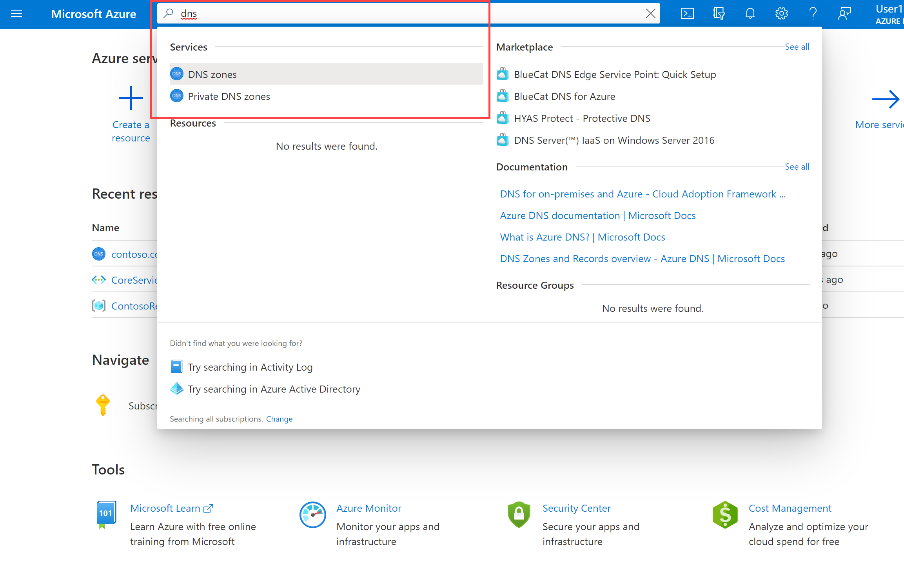
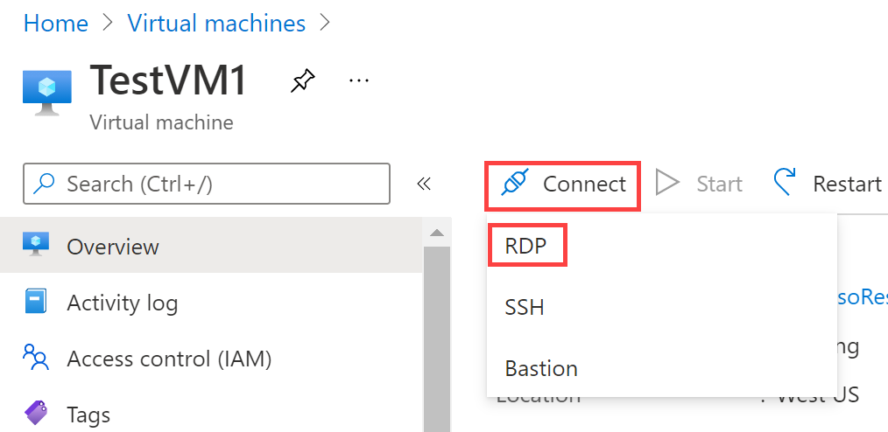

---
lab:
    title: '04a - Implement Network Resolution using Azure DNS'
    module: 'Module 04 - Virtual Networking'
---

# Lab 04b - Implement Network Resolution using Azure DNS

# Student lab manual

## Lab scenario
You have successfully setup your Firewall. Now the IT Administrators at Contoso want to enable connectivity between the resources in your Virtual Network by using the resource names. In this unit, you will configure DNS name resolution for Contoso Ltd. You will create a private DNS zone named contoso.com, link the VNets for registration and resolution, and then create two virtual machines and test the configuration.

## Objectives
In this exercise, you will:

+ Task 1: Create a Private DNS Zone
+ Task 2: Explore Auto Registration of Resources in a Virtual Network
+ Task 3: Configure Public DNS

### Task 1: Create a private DNS Zone

1. Go to [Azure Portal](https://portal.azure.com/).

2. On the Azure home page, in the search bar, enter dns, and then select **Private DNS zones**.  
   ‎

3. In Private DNS zones, select **+ Create**.

4. Use the information in the following table to create the private DNS zone.

| **Tab**         | **Option**                             | **Value**            |
| --------------- | -------------------------------------- | -------------------- |
| Basics          | Resource group                         | az104-04b            |
|                 | Name                                   | Contoso.com          |
| Tags            | No changes required                    |                      |
| Review + create | Review your settings and select Create |                      |


5. Wait until the deployment is complete, and then select **Go to resource**.

6. Verify that the zone has been created.

### Task 2: Link subnet for auto registration

1. In Contoso.com, under **Settings**, select **Virtual network links**.

2. On Contoso.com | Virtual network links, select **+ Add**.


3. Use the information in the following table to add the virtual network link.

| **Option**                          | **Value**                               |
| ----------------------------------- | --------------------------------------- |
| Link name                           | CoreServicesVnetLink                    |
| Subscription                        | No changes required                     |
| Virtual Network                     | CoreServicesVnet (ContosoResourceGroup) |
| Enable auto registration            | Selected                                |
| Review your settings and select OK. |                                         |


4. Select **Refresh**.

5. Verify that the CoreServicesVnetLink has been created, and that auto-registration is enabled.

6. Repeat steps 2 - 5 for the ManufacturingVnet, using the information in the following table: 

| **Option**                          | **Value**                                |
| ----------------------------------- | ---------------------------------------- |
| Link name                           | ManufacturingVnetLink                    |
| Subscription                        | No changes required                      |
| Virtual Network                     | ManufacturingVnet (ContosoResourceGroup) |
| Enable auto registration            | Selected                                 |
| Review your settings and select OK. |                                          |


7. Select **Refresh**.

8. Verify that the ManufacturingVnetLink has been created, and that auto-registration is enabled.

9. Repeat steps 2 - 5 for the ResearchVnet, using the information in the following table: 

| **Option**                          | **Value**                           |
| ----------------------------------- | ----------------------------------- |
| Link name                           | ResearchVnetLink                    |
| Subscription                        | No changes required                 |
| Virtual Network                     | ResearchVnet (ContosoResourceGroup) |
| Enable auto registration            | Selected                            |
| Review your settings and select OK. |                                     |


10. Select **Refresh**.

11. Verify that the ResearchVnetLink has been created, and that auto-registration is enabled.

 

#### Create Virtual Machines to test the configuration

In this section, you will create two test VMs to test the Private DNS zone configuration.

1. In the Azure portal, open the **PowerShell** session within the **Cloud Shell** pane.
    
    > **Note:** If this is the first time opening Cloud Shell, you might be prompted to create a storage account. Select **Create storage**.

2. In the toolbar of the Cloud Shell pane, select the Upload/Download files icon, in the drop-down menu, select Upload and upload the following files **azuredeploy.json** and **azuredeploy.parameters.json** into the Cloud Shell home directory one by one from the source folder **F:\Allfiles\Exercises\M01**.

3. Deploy the following ARM templates to create the VMs needed for this exercise:

   ```powershell
   $RGName = "ContosoResourceGroup"
   
   New-AzResourceGroupDeployment -ResourceGroupName $RGName -TemplateFile azuredeploy.json -TemplateParameterFile azuredeploy.parameters.json
   ```
  
4. When the deployment is complete, go to the Azure portal home page, and then select **Virtual Machines**.

5. Verify that both virtual machines have been created.

 

#### Verify records are present in the DNS zone

1. On the Azure Portal home page, select **Private DNS zones**.

2. In Private DNS zones, select **contoso.com**.

3. Verify that host (A) records are listed for both VMs, as shown:


 

4. Make a note of the names and IP addresses of the VMs.

 

#### Connect to the Test VMs using RDP

1. On the Azure Portal home page, select **Virtual Machines**.

2. Select **TestVM1**. At this point of time, if you do not have Virtual Machines in your Resource Group, Please create two Virtual Machines named **TestVM1** and **TestVM2** in the same Virtual Network and of the size **B2ms** running **Windows Server 2022 Azure Edition**. You can set your own Username and Password for the Virtual Machine.

3. In TestVM1, select **Connect &gt; RDP**.



4. In TestVM1 | Connect, select **Download RDP file**.

5. Save the RDP file to your desktop.

6. On the Azure Portal home page, select **Virtual Machines**.

7. Select **TestVM2**.

8. In TestVM2, select **Connect &gt; RDP**.

9. In TestVM2 | Connect, select **Download RDP file**.

10. Save the RDP file to your desktop.

11. Connect to TestVM1 using the RDP file, and the username **TestUser** and the password **TestPa$$w0rd!**.

12. Connect to TestVM2 using the RDP file, and the username **TestUser** and the password **TestPa$$w0rd!**.

13. On both VMs, in **Choose privacy settings for your device**, select **Accept**.

14. On both VMs, if prompted, in **Networks**, select **Yes**.

15. On TestVM1, open a command prompt and enter the command ipconfig /all.

16. Verify that the IP address is the same as the one you noted in the DNS zone.

17. Enter the command ping TestVM2.contoso.com.

18. Verify that the FQDN resolves to the IP address that you noted in the Private DNS zone. The ping itself will timeout because of the Windows Firewall that is enabled on the VMs.

19. Alternatively, you can enter the command nslookup TestVM2.contoso.com and verify that you receive a successful name resolution record for VM2
 
### Clean up resources

>**Note**: Remember to remove any newly created Azure resources that you no longer use. Removing unused resources ensures you will not see unexpected charges.

>**Note**:  Don't worry if the lab resources cannot be immediately removed. Sometimes resources have dependencies and take a longer time to delete. It is a common Administrator task to monitor resource usage, so just periodically review your resources in the Portal to see how the cleanup is going. 

1. In the Azure portal, open the **PowerShell** session within the **Cloud Shell** pane.

1. List all resource groups created throughout the labs of this module by running the following command:

   ```powershell
   Get-AzResourceGroup -Name 'az104-04b*'
   ```

1. Delete all resource groups you created throughout the labs of this module by running the following command:

   ```powershell
   Get-AzResourceGroup -Name 'az104-04b*' | Remove-AzResourceGroup -Force -AsJob
   ```

    >**Note**: The command executes asynchronously (as determined by the -AsJob parameter), so while you will be able to run another PowerShell command immediately afterwards within the same PowerShell session, it will take a few minutes before the resource groups are actually removed.

### Review Questions
- You have an internal DNS zone named contoso.com and you have an external DNS zone named contoso.com. If you request the webpage from worldwide.contoso.com, which DNS zone will be checked first?
- You have created a Private DNS Zone with Auto Registration and you have enabled peering. Will the other Virtual Network Resources also have Auto Registration enabled?
- You have configured the NIC for VM2 to have a dynamic Private IP Address. The next time you lookup the Private IP Address for VM2, will it reflect the new IP Address?

### Review
In this lab, you have:
+ Configured a Private DNS Zone
+ Configured Auto Registration on the Private DNS Zone